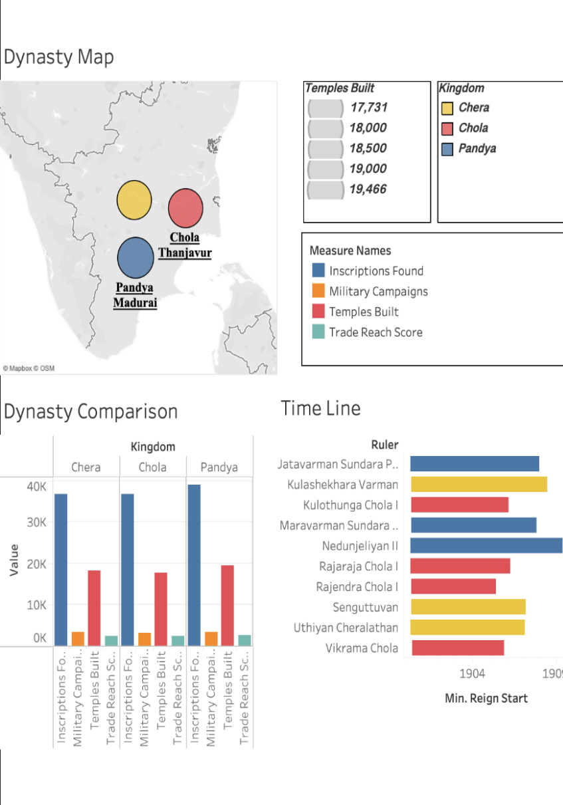
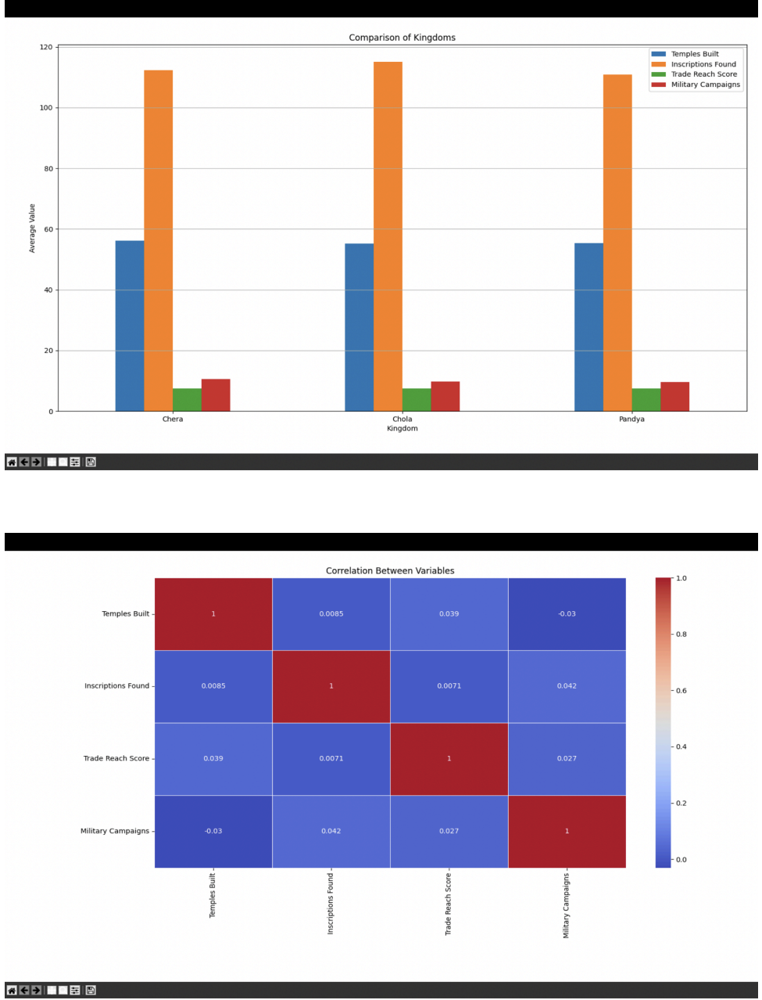

# Dynasty Comparison Data Analysis 📊

A data-driven analysis of the Chola, Chera, and Pandya dynasties using Python, Google Sheets, and Tableau.

---

## 🚀 Features
- Data cleaning and preprocessing
- Comparative analysis of dynasties
- Visualization of key metrics
- Correlation analysis between variables

---

## 📊 Key Insights
- Compared temples built, inscriptions, and trade reach
- Identified patterns across dynasties
- Visualized trends using charts and heatmaps

---

## 🛠 Tech Stack
- Python
- Google Sheets
- Tableau

---

## 📸 Visualizations

---

## 📁 Dataset
- Historical dataset of South Indian dynasties

---

## 📌 Description
This project analyzes historical data of the Chola, Chera, and Pandya kingdoms to uncover insights into their cultural, economic, and military influence.
